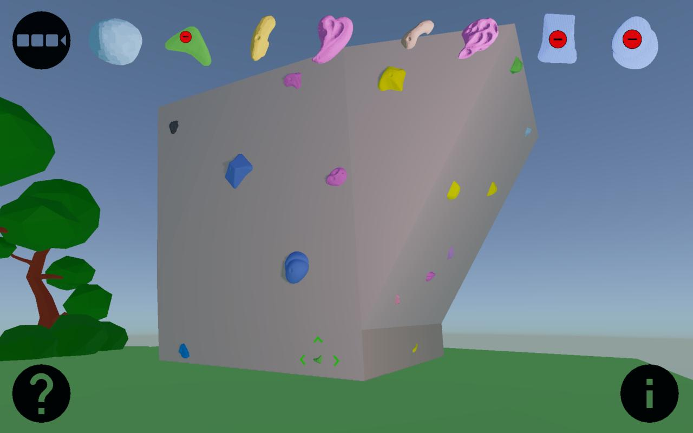

routedesigner
==============

Route Designer is a game/tool for digital route setting that is developed by the [Virtual Wall Project](https://virtualwallproject.org).

## Features

* To-scale 3D rendering of actual climbing holds and walls
* Choice of Nintendo joycon, keyboard, mouse, and touch input
* Virtual hold bucket to easily see and select holds
* Grid-based placement system designed to mimic wall t-nut pattern
* Ability to adjust hold placement to mimic screw-on holds

### Feature Requests

Help select new features by adding your 👍 reaction to [GitHub issues for features](https://github.com/virtualwallproject/routedesigner/labels/feature%20request) you would like to see added

## Supported platforms

* HTML5 in browser (requires WebGL 2, Chrome recommended)
* Android, ChromeOS (download on [Google Play](https://play.google.com/store/apps/details?id=virtualwallproject.kode.kore))
* Linux, macOS, Windows
* Coming soon: iOS

## Quick Setup for Developers

Follow these steps to use this repository for building your own local copy of the game:

1. [Download](https://www.blender.org/download/) Blender 2.83 LTS
2. [Setup](https://github.com/armory3d/armory/wiki/setup) the Armory add-on
3. Clone this repo to a local directory
4. Open the *.blend file from your local copy of the repo
5. In the Blender _Properties_ Panel (Shift F7) go to _Render Properties_ -> _Armory Player_ and click _Play_ to test the game in your web browser

